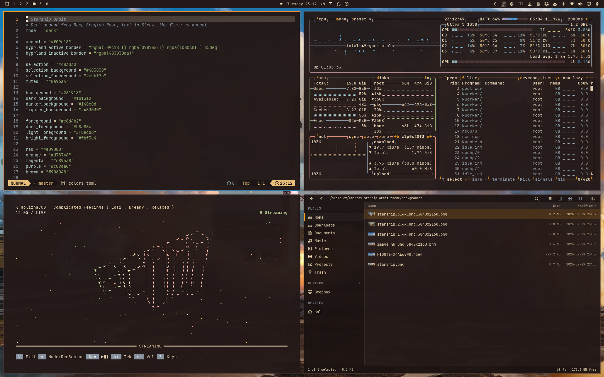
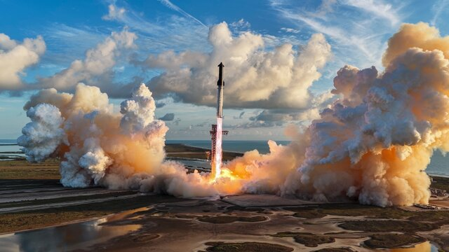
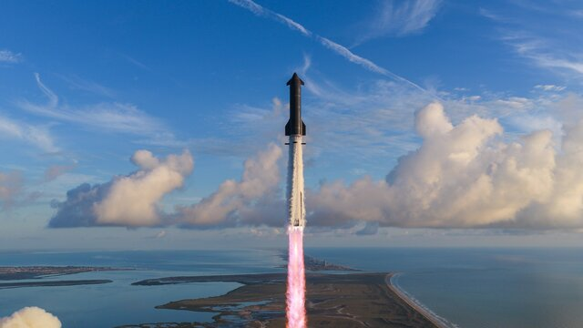
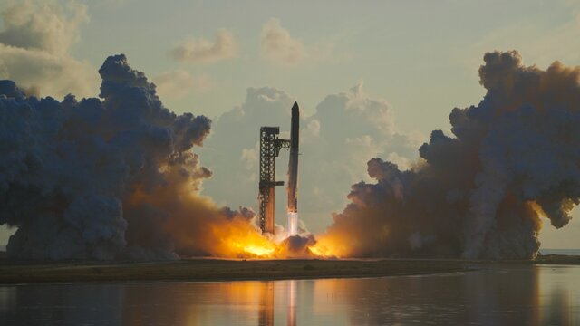
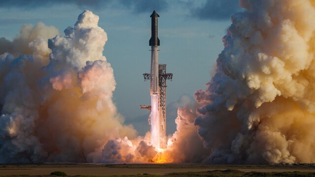

# omarchy-starship-orbit-theme



Thirty-three engines light at once. The ground shakes, the marsh vanishes
under white, and the largest, most powerful rocket ever built climbs out of
Starbase on a pillar of fire. On 28 September 2026, Starship went to orbit.

This theme celebrates that moment: life, engineering, and the WE CAN FIX
EVERYTHING spirit, manifested in rocket propulsion.

Every colour comes from that liftoff. The flame is the accent. The sunlit
plumes carry the text. The ground glows like the pad at dusk, and the sky
over the Gulf and the marsh around the tower fill in the rest.

## Installation

```bash
omarchy theme install https://github.com/AlexZeitler/omarchy-starship-orbit-theme
```

## Screenshots

Click a thumbnail to open the wallpaper in full resolution.

### Liftoff

[](backgrounds/01-liftoff.png)

### Over the coast

[](backgrounds/02-over-the-coast.png)

### Across the water

[](backgrounds/03-across-the-water.png)

### At the tower

[](backgrounds/04-at-the-tower.png)

## Palette

The colours come from a palette by Meditations in Color, drawn from one of
the launch photographs.

| Role       | Colour    | Source in the palette          |
|------------|-----------|--------------------------------|
| Background | `#231918` | Deep Greyish Rose, deepened    |
| Surfaces   | `#483030` | Deep Greyish Rose              |
| Foreground | `#E8D4B2` | Straw, lightened               |
| Muted      | `#8A96A4` | Greyish Azure, lightened       |
| Accent     | `#F09C18` | Dark Chrome Yellow, the flame  |
| Red        | `#E09080` | Light Red                      |
| Orange     | `#D78748` | Burnt Ochre                    |
| Yellow     | `#EBBF7C` | Straw                          |
| Blue       | `#3F93D6` | Viridian, lightened            |
| Cyan       | `#90B0B0` | Light Greyish Cyan             |
| Brown      | `#906048` | Raw Umber                      |

The palette has no green. Green is a sage taken from the marshland around the
pad, and magenta is a soft rose between Light Red and Deep Greyish Rose.

The active window border is a gradient from the flame through Burnt Ochre to
Viridian, set through `hyprland_active_border` in `colors.toml`.

## License

The colours and configuration files are MIT licensed, see `LICENSE`.

The wallpapers are not covered by that licence. They are upscaled from
photographs by SpaceX, posted by [@SpaceX](https://x.com/SpaceX) on X on
28 September 2026. All rights to the photographs remain with SpaceX.

The colour palette is by Meditations in Color.
